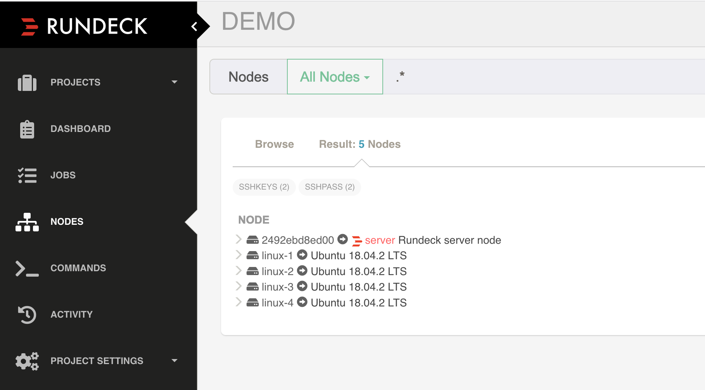
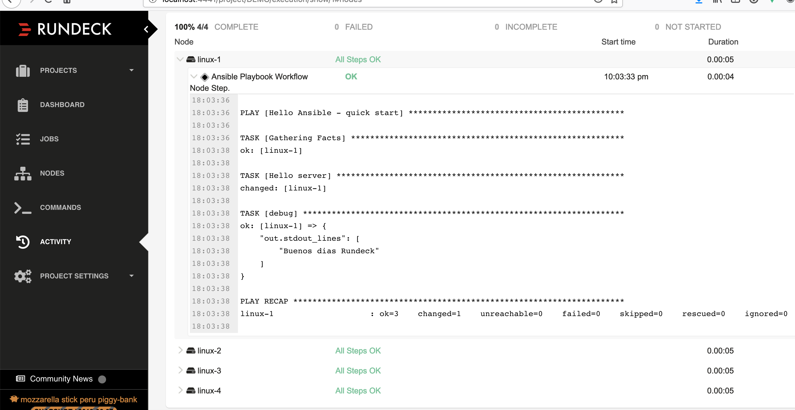

# Rundeck - Ansible DEMO

A docker-compose DEMO to use rundeck-ansible plugin https://github.com/Batix/rundeck-ansible-plugin

This example has 4 ssh nodes, 2 for authenticate using SSH Keys and other 2 with password.
The password is encrypted on the group_vars file (sshpass.yaml). The encrypted key is storade on a file `masterPassword.txt`

## How to use

* Build: `make build`
* Start Demo: `make start`
* Stop Demo: `make clean`

## About generating group_vars file with an encrypted password


* prompting the password

```
ansible-vault encrypt_string 'rundeck' --name 'ansible_ssh_pass'
New Vault password: 
```

* or Using master password file
```
ansible-vault encrypt_string --vault-password-file /home/rundeck/ansible/group_vars/masterPassword.txt 'rundeck' --name 'ansible_ssh_pass'

```

further information: https://docs.ansible.com/ansible/latest/user_guide/vault.html


Copy the result to `/home/rundeck/ansible/group_vars/sshpass.yml` file

```
ansible-password: !vault |
          $ANSIBLE_VAULT;1.1;AES256
          65353836336464393837306366653935653436646233666439323836316137343035396332323035
          6437303137396632613638363964333837623961346634650a643732396339303463396336643238
          31376233303636616339373831393238643933343935623937393337343537373661306563613631
          3638313937366633610a666661316130653437626535343363313334643430386336663763343837
          3063
          
```






